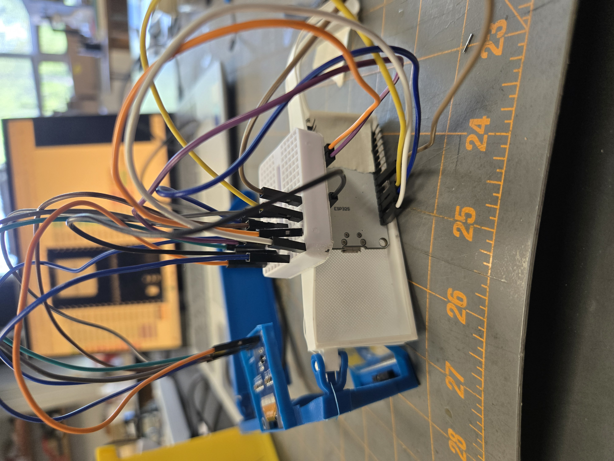
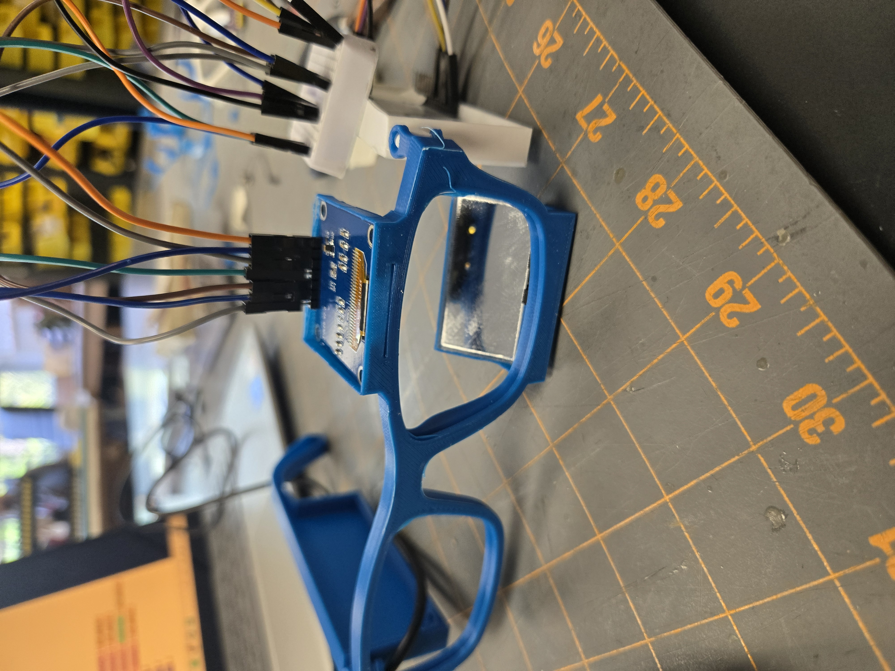
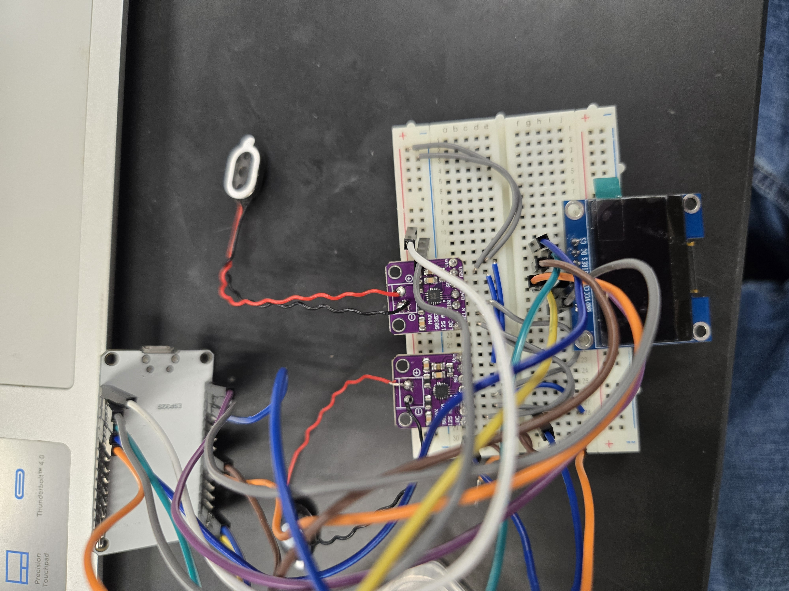

# Arch

### Background
Don't you ever wish that you could just do everything you ever wanted from your glasses?

---

### Capabilites 
The things that this is capable of 
- Waveguide Display
- Headphones - Bluetooth speaker tings
- Media keys
- AI integration + talking

---

### 3d print 
I lost the actual CAD file because I forgot to transfer my CAD files from my school fusion360 account to my personal account, yet here are picture examples of what it looks like.

I took already existing glasses models, traced them and enlarged them in order to fit everything inside of the sides of the ear. 

---

For the mirror I ensured that the mirror would be at a 45% angle in order for the light from my oled would properly bounce off it and into my lenses. Additionally for the oled holding, I measured the oled and placed holders for the oled where the skrew holes are in order to hold it up while not covering the screen.

---

And of course the display does have some problems when being looked at in a very bright room, yet it is still visiable and doing its job in any light. And while it is hard to take a picture that truly conveys what it's like seeing a sort of holographic image, this is the best I got.
.jpg](https://github.com/Ingenieria-Olvera/Arch/blob/main/20250209_175423%20(1).jpg))

---

### Electronics
This is a clear example of what the pure electronic wiring looked like on a bread board

